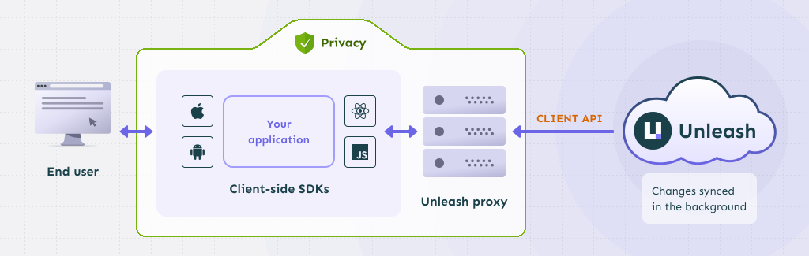
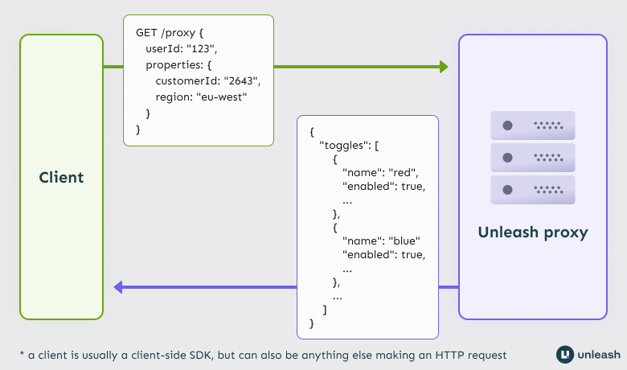

**This project is in maintenance mode. No new features will be added and we will only do security patches in this repository going forward. Use [Unleash Edge](https://github.com/unleash/unleash-edge) instead.**

[](https://github.com/Unleash/unleash-proxy/actions/workflows/node.js.yml) [](https://www.npmjs.com/package/@unleash/proxy) [](https://hub.docker.com/r/unleashorg/unleash-proxy)

# The Unleash Proxy

The Unleash proxy offers a way to use Unleash in client-side applications, such as single-page and native apps. The Unleash proxy sits between the Unleash API and your client-side SDK and does the evaluation of feature toggles for your client-side SDK. This way, you can keep your configuration private and secure, while still allowing your client-side apps to use Unleash's features.

The proxy offers three important features:

- **Performance**: The caches all features in memory and can run close to your end-users. A single instance can able to handle thousands of requests per second, and you can easily scale it by adding additional instances.
- **Security**: The proxy evaluates the features for the user on the server-side and by default only exposes results for features that are **enabled** for the specific user. No feature toggle configuration is ever shared with the user.
- **Privacy**: If you run the proxy yourself, Unleash will never get any data on your end-users: no user ids, no IPs, no nothing.

<figure>
    
    <figcaption>Client-side apps connect to the Unleash proxy, which in turn connects to the Unleash API. The proxy itself uses the Unleash Node.js SDK to evaluate features. The SDK syncs with Unleash in the background. Local evaluation on the proxy provides privacy.</figcaption>
</figure>

## A note on privacy and the proxy

Why would you not want to expose your Unleash configuration to your end-users?

The way Unleash works, you can add all kinds of data to feature strategies and constraints. For instance, you might show a feature only to a specific subset of user IDs; or you might have a brand new and unannounced new feature with a revealing name.

If you just sent the regular Unleash client payload to your client-side apps, all of this — the user IDs and the new feature names — would be exposed to your users.

Single page apps work in the context of a specific user. The proxy allows you to only provide data that relates to that one user: **The proxy will default to only returning the evaluated toggles that should be enabled for that _specific_ user in that _specific_ context.**

## API

The Unleash proxy exposes a simple API for consumption by client-side SDKs.

### OpenAPI integration

---

ℹ️ **Availability**

The OpenAPI integration is available in versions 0.9 and later of the Unleash proxy.

---

The proxy can expose a runtime-generated OpenAPI JSON spec and a corresponding OpenAPI UI for its API. The OpenAPI UI page is an interactive page where you can discover and test the API endpoints the proxy exposes. The JSON spec can be used to generate an OpenAPI client with OpenAPI tooling such as the [OpenAPI generator](https://openapi-generator.tech/).

To enable the JSON spec and UI, set `ENABLE_OAS` (environment variable) or `enableOAS` (in-code configuration variable) to `true`.

The spec and UI can then be found at `<base url>/docs/openapi.json` and `<base url>/docs/openapi` respectively.

You can refer to the [how to enable the OpenAPI spec](https://docs.getunleash.io/how-to/how-to-enable-openapi) guide for more detailed information on how to configure it.

### `GET /proxy`

The primary proxy API operation. This endpoint accepts an Unleash context encoded as query parameters, and will return all toggles that are evaluated as true for the provided context.

<figure>
    
    <figcaption>When sending GET requests to the Unleash proxy's /proxy endpoint, the request should contain the current Unleash context as query parameters. The proxy will return all enabled toggles for the provided context.</figcaption>
</figure>

### Payload

The `GET /proxy` operation returns information about toggles enabled for the current user. The payload is a JSON object with a `toggles` property, which contains a list of toggles.

```json
{
  "toggles": [
    {
      "name": "demo",
      "enabled": true,
      "variant": {
        "name": "disabled",
        "enabled": false
      }
    },
    {
      "name": "demoApp.step1",
      "enabled": true,
      "variant": {
        "name": "disabled",
        "enabled": false
      }
    }
  ]
}
```

#### Toggle data

The data for a toggle without [variants](https://docs.getunleash.io/reference/feature-toggle-variants) looks like this:

```json
{
  "name": "basic-toggle",
  "enabled": true,
  "variant": {
    "name": "disabled",
    "enabled": false
  }
}
```

- **`name`**: the name of the feature.
- **`enabled`**: whether the toggle is enabled or not. Will always be `true`.
- **`variant`**: describes whether the toggle has variants and, if it does, what variant is active for this user. If a toggle doesn't have any variants, it will always be `{"name": "disabled", "enabled": false}`.

---

ℹ️ **The "disabled" variant**

Unleash uses a fallback variant called "disabled" to indicate that a toggle has no variants. However, you are free to create a variant called "disabled" yourself. In that case you can tell them apart by checking the variant's `enabled` property: if the toggle has no variants, `enabled` will be `false`. If the toggle is the "disabled" variant that you created, it will have `enabled` set to `true`.

---

If a toggle has variants, then the variant object can also contain an optional `payload` property. The `payload` will contain data about the variant's payload: what type it is, and what the content is. To learn more about variants and their payloads, check [the feature toggle variants documentation](https://docs.getunleash.io/reference/feature-toggle-variants).

Variant toggles without payloads look will have their name listed and the `enabled` property set to `true`:

```json
{
  "name": "toggle-with-variants",
  "enabled": true,
  "variant": {
    "name": "simple",
    "enabled": true
  }
}
```

If the variant has a payload, the optional `payload` property will list the payload's type and it's content in a stringified form:

```json
{
  "name": "toggle-with-variants",
  "enabled": true,
  "variant": {
    "name": "with-payload-string",
    "payload": {
      "type": "string",
      "value": "this string is the variant's payload"
    },
    "enabled": true
  }
}
```

For the `variant` property:

- **`name`**: is the name of the variant, as shown in the Admin UI.
- **`enabled`**: indicates whether the variant is enabled or not. If the toggle has variants, this is always `true`.
- **`payload`** (optional): Only present if the variant has a payload. Describes the payload's type and content.

If the variant has a payload, the `payload` object contains:

- **`type`**: the type of the variant's payload
- **`value`**: the value of the variant's payload

The `value` will always be the payload's content as a string, escaped as necessary. For instance, a variant with a JSON payload would look like this:

```json
{
  "name": "toggle-with-variants",
  "enabled": true,
  "variant": {
    "name": "with-payload-json",
    "payload": {
      "type": "json",
      "value": "{\"description\": \"this is data delivered as a json string\"}"
    },
    "enabled": true
  }
}
```

### `POST /proxy`

The proxy also offers a POST API used to evaluate toggles This can be used to evaluate a list of know toggle names or to retrieve all _enabled_ toggles for a given context.

#### Evaluate list of known toggles

This method will allow you to send a list of toggle names together with an Unleash Context and evaluate them accordingly. It will return enablement of all provided toggles.

**URL**: `POST https://proxy-host.server/proxy`

**Content Type**: `application/json`

**Body:**

```json
{
  "toggles": ["demoApp.step1"],
  "context": {
    "appName": "someApp",
    "sessionId": "233312AFF22"
  }
}
```

Result:

```
HTTP/1.1 200 OK
Access-Control-Allow-Origin: *
Access-Control-Expose-Headers: ETag
Cache-control: public, max-age=2
Connection: keep-alive
Content-Length: 122
Content-Type: application/json; charset=utf-8
Date: Wed, 30 Nov 2022 14:46:48 GMT
ETag: W/"7a-RMKUyY0BWIhjahpVPWnNdXyDw6I"
Keep-Alive: timeout=5
Vary: Accept-Encoding

{
    "toggles": [
        {
            "enabled": false,
            "impressionData": true,
            "name": "demoApp.step1",
            "variant": {
                "enabled": false,
                "name": "disabled"
            }
        }
    ]
}

```

#### Evaluate all enabled toggles

This method will allow you to get all enabled toggles for a given context.

**URL**: `POST https://proxy-host.server/proxy`

**Content Type**: `application/json`

**Body:**

```json
{
  "context": {
    "appName": "someApp",
    "sessionId": "233312AFF22"
  }
}
```

Result:

```
HTTP/1.1 200 OK
Access-Control-Allow-Origin: *
Access-Control-Expose-Headers: ETag
Cache-control: public, max-age=2
Connection: keep-alive
Content-Length: 465
Content-Type: application/json; charset=utf-8
Date: Wed, 30 Nov 2022 14:48:55 GMT
ETag: W/"1d1-dm6tkvMpkx42mZmojNSNKmHid1M"
Keep-Alive: timeout=5
Vary: Accept-Encoding

{
    "toggles": [
        {
            "enabled": true,
            "impressionData": false,
            "name": "demoApp.step2",
            "variant": {
                "enabled": true,
                "name": "userWithId",
                "payload": {
                    "type": "string",
                    "value": "90732934"
                }
            }
        },
        {
            "enabled": true,
            "impressionData": false,
            "name": "demoApp.step3",
            "variant": {
                "enabled": true,
                "name": "C",
                "payload": {
                    "type": "string",
                    "value": "hello"
                }
            }
        },
        {
            "enabled": true,
            "impressionData": true,
            "name": "demoApp.step4",
            "variant": {
                "enabled": true,
                "name": "Orange",
                "payload": {
                    "type": "string",
                    "value": "orange"
                }
            }
        }
    ]
}


```

### `GET /proxy/all` Return enabled **and** disabled toggles:

By default, the proxy only returns enabled toggles. However, in certain use cases, you might want it to return **all** toggles, regardless of whether they're enabled or disabled. The `/proxy/all` endpoint does this.

Because returning all toggles regardless of their state is a potential security vulnerability, the endpoint has to be explicitly enabled. To enable it, set the `enableAllEndpoint` configuration option or the `ENABLE_ALL_ENDPOINT` environment variable to `true`.

The response payload follows the same format as the [`GET /proxy` response payload](#payload).

### `GET /proxy/health`: Health endpoint

The proxy will try to synchronize with the Unleash API at startup, until it has successfully done that the proxy will return `HTTP 503 - Not Ready` for all request. You can use the health endpoint to validate that the proxy is ready to receive requests:

```bash
curl http://localhost:3000/proxy/health -I
```

If the proxy is ready, the response should look a little something like this:

```bash
HTTP/1.1 200 OK
Access-Control-Allow-Origin: *
Access-Control-Expose-Headers: ETag
Content-Type: text/html; charset=utf-8
Content-Length: 2
ETag: W/"2-eoX0dku9ba8cNUXvu/DyeabcC+s"
Date: Fri, 04 Jun 2021 10:38:27 GMT
Connection: keep-alive
Keep-Alive: timeout=5
```

## Configuration options

The Proxy has a large number of configuration options that you can use to adjust it to your specific use case. The following table lists all the available options.

---

ℹ️ **Required configuration**

You **must configure** these three variables for the proxy to start successfully:

- `unleashUrl` / `UNLEASH_URL`

- `unleashApiToken` / `UNLEASH_API_TOKEN`

- `clientKeys` / `UNLEASH_PROXY_CLIENT_KEYS`

---

| Option | Environment Variable | Default value | Required | Description |
| --- | --- | --- | :-: | --- |
| unleashUrl | `UNLEASH_URL` | n/a | yes | API Url to the Unleash instance to connect to |
| unleashApiToken | `UNLEASH_API_TOKEN` | n/a | yes | API token (client) needed to connect to Unleash API. |
| clientKeys | `UNLEASH_PROXY_CLIENT_KEYS` | n/a | yes | List of client keys that the proxy should accept. When querying the proxy, Proxy SDKs must set the request's _client keys header_ to one of these values. The default client keys header is `Authorization`. |
| proxySecrets | `UNLEASH_PROXY_SECRETS` | n/a | no | Deprecated alias for `clientKeys`. Please use `clientKeys` instead. |
| n/a | `PORT` or `PROXY_PORT` | 3000 | no | The port where the proxy should listen. |
| proxyBasePath | `PROXY_BASE_PATH` | "" | no | The base path to run the proxy from. "/proxy" will be added at the end. For instance, if `proxyBasePath` is `"base/path"`, the proxy will run at `/base/path/proxy`. |
| unleashAppName | `UNLEASH_APP_NAME` | "unleash-proxy" | no | App name to used when registering with Unleash |
| unleashInstanceId | `UNLEASH_INSTANCE_ID` | `generated` | no | Unleash instance id to used when registering with Unleash |
| refreshInterval | `UNLEASH_FETCH_INTERVAL` | 5000 | no | How often the proxy should query Unleash for updates, defined in ms. |
| metricsInterval | `UNLEASH_METRICS_INTERVAL` | 30000 | no | How often the proxy should send usage metrics back to Unleash, defined in ms. |
| metricsJitter | `UNLEASH_METRICS_JITTER` | 0 | no | Adds jitter to the metrics interval to avoid multiple instances sending metrics at the same time, defined in ms. |
| environment | `UNLEASH_ENVIRONMENT` | `undefined` | no | If set this will be the `environment` used by the proxy in the Unleash Context. It will not be possible for proxy SDKs to override the environment if set. |
| projectName | `UNLEASH_PROJECT_NAME` | `undefined` | no | The projectName (id) to fetch feature toggles for. The proxy will only return know about feature toggles that belongs to the project, if specified. |
| logger | n/a | SimpleLogger | no | Register a custom logger. |
| useJsonLogger | `JSON_LOGGER` | false | no | Sets the default logger to log as one-line JSON. This has no effect if a custom logger is provided. |
| logLevel | `LOG_LEVEL ` | "warn" | no | Used to set logLevel. Supported options: "debug", "info", "warn", "error" and "fatal" |
| customStrategies | `UNLEASH_CUSTOM_STRATEGIES_FILE` | [] | no | Use this option to inject implementation of custom activation strategies. If you are using `UNLEASH_CUSTOM_STRATEGIES_FILE` you need to provide a valid path to a javascript file which exports an array of custom activation strategies and the SDK will automatically load these |
| trustProxy | `TRUST_PROXY ` | `false` | no | By enabling the trustProxy option, Unleash Proxy will have knowledge that it's sitting behind a proxy and that the X-Forwarded-\* header fields may be trusted, which otherwise may be easily spoofed. The proxy will automatically enrich the ip address in the Unleash Context. Can either be `true/false` (Trust all proxies), trust only given IP/CIDR (e.g. `'127.0.0.1'`) as a `string`. May be a list of comma separated values (e.g. `'127.0.0.1,192.168.1.1/24'` |
| namePrefix | `UNLEASH_NAME_PREFIX` | undefined | no | Used to filter features by using prefix when requesting backend values. |
| tags | `UNLEASH_TAGS` | undefined | no | Used to filter features by using tags set for features. Format should be `tagName:tagValue,tagName2:tagValue2` |
| clientKeysHeaderName | `CLIENT_KEY_HEADER_NAME` | "authorization" | no | The name of the HTTP header to use for client keys. Incoming requests must set the value of this header to one of the Proxy's `clientKeys` to be authorized successfully. |
| storageProvider | n/a | `undefined` | no | Register a custom storage provider. Refer to the [section on custom storage providers in the Node.js SDK's readme](https://github.com/Unleash/unleash-client-node/#custom-store-provider) for more information. |
| enableOAS | `ENABLE_OAS` | `false` | no | Set to `true` to expose the proxy's OpenAPI spec at `/docs/openapi.json` and an interactive OpenAPI UI at `/docs/openapi`. Read more in the [OpenAPI section](#openapi). |
| enableAllEndpoint | `ENABLE_ALL_ENDPOINT` | `false` | no | Set to `true` to expose the `/proxy/all` endpoint. Refer to the [section on returning all toggles](#return-enabled-and-disabled-toggles) for more info. |
| cors | n/a | n/a | no | Pass custom options for [CORS module](https://www.npmjs.com/package/cors#configuration-options) |
| cors.allowedHeaders | `CORS_ALLOWED_HEADERS` | n/a | no | Headers to allow for CORS |
| cors.credentials | `CORS_CREDENTIALS` | `false` | no | Allow credentials in CORS requests |
| cors.exposedHeaders | `CORS_EXPOSED_HEADERS` | "ETag" | no | Headers to expose for CORS |
| cors.maxAge | `CORS_MAX_AGE` | 172800 | no | Maximum number of seconds to cache CORS results |
| cors.methods | `CORS_METHODS` | "GET, POST" | no | Methods to allow for CORS |
| cors.optionsSuccessStatus | `CORS_OPTIONS_SUCCESS_STATUS` | 204 | no | If the Options call passes CORS, which http status to return |
| cors.origin | `CORS_ORIGIN` | \* | no | Origin URL or list of comma separated list of URLs to whitelist for CORS |
| cors.preflightContinue | `CORS_PREFLIGHT_CONTINUE` | `false` | no |  |
| httpOptions.rejectUnauthorized | `HTTP_OPTIONS_REJECT_UNAUTHORIZED` | `true` | no | If true, unleash-proxy will automatically reject connections to unleash server with invalid certificates |
|  | `HTTP_PROXY` | n/a | no | Proxy server for HTTP requests |
|  | `HTTPS_PROXY` | n/a | no | Proxy server for HTTPS requests |

### Experimental configuration options

Some functionality is under validation and introduced as experimental. This allows us to test new functionality early and quickly. Experimental options can change or be removed at any point in the future and are explicitly **not** part of the proxy's semantic versioning.

| Option | Environment Variable | Default value | Required | Description |
| --- | --- | --- | :-: | --- |
| expBootstrap | n/a | n/a | no | Where the Proxy can bootstrap configuration from. See [Node.js SDK](https://github.com/Unleash/unleash-client-node#bootstrap) for details. |
| expBootstrap.url | `EXP_BOOTSTRAP_URL` | n/a | no | Url where the Proxy can bootstrap configuration from. See [Node.js SDK](https://github.com/Unleash/unleash-client-node#bootstrap) for details. |
| expBootstrap.urlHeaders.Authorization | `EXP_BOOTSTRAP_AUTHORIZATION` | n/a | no | Authorization header value to be used when bootstrapping |
| expServerSideSdkConfig.tokens | `EXP_SERVER_SIDE_SDK_CONFIG_TOKENS` | n/a | no | API tokens that can be used by Server SDKs (and proxies) to read feature toggle configuration from this Proxy instance. |

| Option | Environment Variable | Default value | Required | Description |
| --- | --- | --- | :-: | --- |
| expBootstrap | n/a | n/a | no | Where the Proxy can bootstrap configuration from. See [Node.js SDK](https://github.com/Unleash/unleash-client-node#bootstrap) for details. |
| expBootstrap.url | `EXP_BOOTSTRAP_URL` | n/a | no | Url where the Proxy can bootstrap configuration from. See [Node.js SDK](https://github.com/Unleash/unleash-client-node#bootstrap) for details. |
| expBootstrap.urlHeaders.Authorization | `EXP_BOOTSTRAP_AUTHORIZATION` | n/a | no | Authorization header value to be used when bootstrapping |
| expServerSideSdkConfig.tokens | `EXP_SERVER_SIDE_SDK_CONFIG_TOKENS` | n/a | no | API tokens that can be used by Server SDKs (and proxies) to read feature toggle configuration from this Proxy instance. |
| expCustomEnrichers | `EXP_CUSTOM_ENRICHERS_FILE` | [] | no | Use this option to inject implementation of custom context enrichers. If you are using `EXP_CUSTOM_ENRICHERS_FILE` you need to provide a valid path to a javascript file which exports an array of custom context enrichers and the SDK will automatically load these |

## Internal SDK capabilities

The proxy uses the [Node.js SDK](https://github.com/Unleash/unleash-client-node) internally. When you start the proxy it initializes a client for you using any configuration option you provided on startup. You can also provide your own client.

The client that the proxy uses supports all the SDK features that the Node.js SDK supports, as listed in the [Unleash server-side compatibility overview](https://docs.getunleash.io/reference/sdks#server-side-sdk-compatibility-table). The proxy has supported advanced [strategy constraints](https://docs.getunleash.io/reference/strategy-constraints) since version 0.8. Because the proxy uses the Node SDK internally,

## Run The Unleash Proxy

The Unleash proxy is a small stateless HTTP application you run. The only requirement is that it needs to be able to talk with the Unleash API (either Unleash OSS or Unleash Hosted).

### Run with Docker

The easies way to run Unleash is via Docker. We have published a [docker image on docker hub](https://hub.docker.com/r/unleashorg/unleash-proxy/).

**Step 1: Pull**

```bash
docker pull unleashorg/unleash-proxy
```

**Step 2: Start**

```bash
docker run \
   -e UNLEASH_PROXY_CLIENT_KEYS=some-secret \
   -e UNLEASH_URL=https://app.unleash-hosted.com/demo/api/ \
   -e UNLEASH_API_TOKEN=56907a2fa53c1d16101d509a10b78e36190b0f918d9f122d \
   -p 3000:3000 \
   unleashorg/unleash-proxy
```

You should see the following output:

```bash
Unleash-proxy is listening on port 3000!
```

**Step 3: verify**

In order to verify the proxy you can use curl and see that you get a few evaluated feature toggles back:

```bash
curl http://localhost:3000/proxy -H "Authorization: some-secret"
```

Expected output would be something like:

```json
{
  "toggles": [
    {
      "name": "demo",
      "enabled": true,
      "variant": {
        "name": "disabled",
        "enabled": false
      }
    },
    {
      "name": "demoApp.step1",
      "enabled": true,
      "variant": {
        "name": "disabled",
        "enabled": false
      }
    }
  ]
}
```

**Health endpoint**

The proxy will try to synchronize with the Unleash API at startup, until it has successfully done that the proxy will return `HTTP 503 - Not Read?` for all request. You can use the health endpoint to validate that the proxy is ready to recieve requests:

```bash
curl http://localhost:3000/proxy/health -I
```

```bash
HTTP/1.1 200 OK
Access-Control-Allow-Origin: *
Access-Control-Expose-Headers: ETag
Content-Type: text/html; charset=utf-8
Content-Length: 2
ETag: W/"2-eoX0dku9ba8cNUXvu/DyeabcC+s"
Date: Fri, 04 Jun 2021 10:38:27 GMT
Connection: keep-alive
Keep-Alive: timeout=5
```

**Prometheus endpoint**

The proxy has a prometheus metrics endpoint available at http://localhost:3000/proxy/internal-backstage/prometheus
With the following metrics 
* `unleash_proxy_up` a [counter](https://prometheus.io/docs/concepts/metric_types/#counter) which is set to 1 when proxy is running
* `last_metrics_update_epoch_timestamp_ms` a [gauge](https://prometheus.io/docs/concepts/metric_types/#gauge) set to the epoch timestamp in ms when the proxy last received a feature update
* `last_metrics_fetch_epoch_timestamp_ms` a [gauge](https://prometheus.io/docs/concepts/metric_types/#gauge) set to the epoch timestamp in ms when the proxy last checked for updates


### Run with Node.js:

**STEP 1: Install dependency**

```
npm install @unleash/proxy
```

**STEP 2: use in your code**

```js
const port = 3000;

const { createApp } = require('@unleash/proxy');

const app = createApp({
  unleashUrl: 'https://app.unleash-hosted.com/demo/api/',
  unleashApiToken: '56907a2fa53c1d16101d509a10b78e36190b0f918d9f122d',
  clientKeys: ['proxy-secret', 'another-proxy-secret', 's1'],
  refreshInterval: 1000,
  // logLevel: 'info',
  // projectName: 'order-team',
  // environment: 'development',
});

app.listen(port, () =>
  // eslint-disable-next-line no-console
  console.log(`Unleash Proxy listening on http://localhost:${port}/proxy`),
);
```

## How to connect to the Proxy?

Unleash offers several different [client-side SDKs](https://docs.getunleash.io/reference/sdks#client-side-sdks) for a number of use cases, and the community has created even more. These SDKs connect to the proxy and integrate with well with their designated language/framework. They also sync with the proxy at periodic intervals and post usage metrics back to Unleash via the proxy.

For applications where there is no appropriate client-side SDK or where you simply want to avoid the dependency, you could also get away with using a simple HTTP-client if you just want to get the list of active features.

The proxy is also ideal fit for serverless functions such as AWS Lambda. In that scenario the proxy can run on a small container near the serverless function, preferably in the same VPC, giving the lambda extremely fast access to feature flags, at a predictable cost.

## Custom activation strategies

---

ℹ️ **Limitations for hosted proxies**

Custom activation strategies can **not** be used with the Unleash-hosted proxy available to Pro and Enterprise customers.

---

The Unleash Proxy can load [custom activation strategies](https://docs.getunleash.io/reference/custom-activation-strategies) for [client-side SDKs](https://docs.getunleash.io/reference/sdks#client-side-sdks). For a step-by-step guide, refer to the [_how to use custom strategies_ guide](https://docs.getunleash.io/how-to/how-to-use-custom-strategies#step-3-b).

To load custom strategies, use either of these two options:

- the **`customStrategies`** option: use this if you're running the Unleash Proxy via Node directly.
- the **`UNLEASH_CUSTOM_STRATEGIES_FILE`** environment variable: use this if you're running the proxy as a container.

Both options take a list of file paths to JavaScript files that export custom strategy implementations.

### Custom activation strategy files format

Each strategy file must export a list of instantiated strategies. A file can export as many strategies as you'd like.

Here's an example file that exports two custom strategies:

```js
const { Strategy } = require('unleash-client');

class MyCustomStrategy extends Strategy {
  // ... strategy implementation
}

class MyOtherCustomStrategy extends Strategy {
  // ... strategy implementation
}

// export strategies
module.exports = [new MyCustomStrategy(), new MyOtherCustomStrategy()];
```

Refer the [custom activation strategy documentation](https://docs.getunleash.io/reference/custom-activation-strategies#implementation) for more details on how to implement a custom activation strategy.
